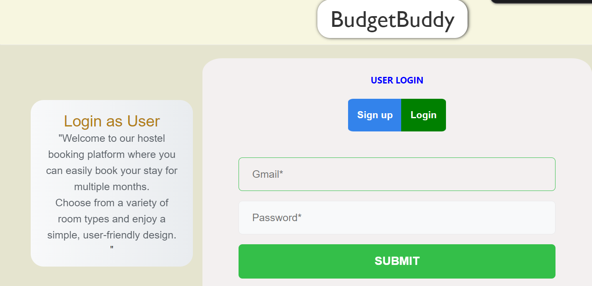
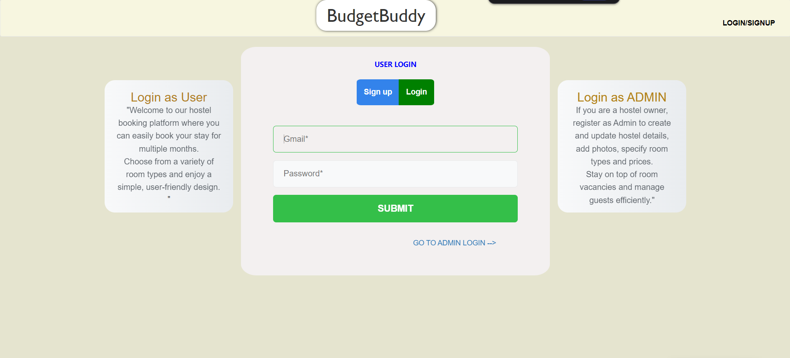
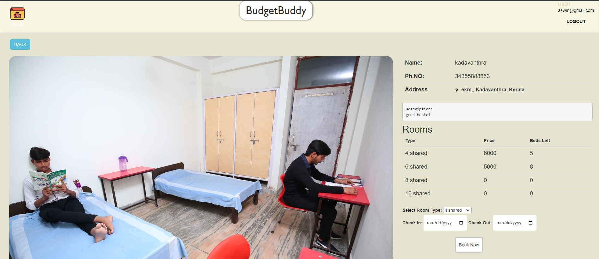
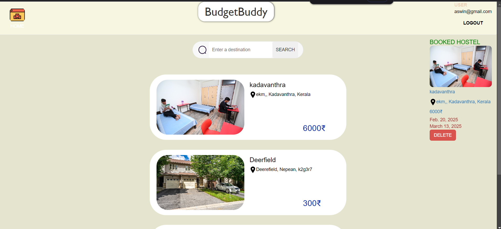

# 🏨 BudgetBuddy

> Hostel Booking Web App — Built for admins and users to manage and book hostel rooms with ease.



---

## 📌 Project Overview

**BudgetBuddy** is a modern hostel booking platform where:

- 👤 **Users** can:
  - Sign up and log in
  - Search hostels by name or location
  - View available room types and their prices
  - Select date ranges for booking
  - View current bookings and total cost

- 🛠️ **Admins** can:
  - Register and log in as admin
  - Add, edit, or delete hostel details
  - Upload hostel images
  - Set room availability and pricing

---

## 📸 Screenshots

### 🔐 Login Page (Admin/User Selection)


---

### 🏘️ Hostel Listings
Users can view all available hostels and prices.


---

### 🛏️ Booking Page
View hostel details, select room type, and book for a date range.


---

### 📅 View Bookings
User’s current booking with pricing and delete option.


---

## 🧠 How it Works

- Hostels are added by admins
- Users book by selecting available rooms
- Backend updates the remaining room count dynamically
- Booking history is visible on user dashboard

---

## ⚙️ Tech Stack

- **Frontend**: HTML, CSS, JavaScript, Bootstap.
- **Backend**: Python
- **Database**: Django, xamp.

---

## 🚀 Getting Started

```bash
# Clone the repo
git clone https://github.com/Aswinksanthosh/Project_1_Hostel_Booking

# Navigate into the project
cd Project_1_Hostel_Booking

# Install dependencies
npm install

# Start the server
npm start
